## Лабораторная работа 7. Анализ и преобразование кода с использованием Clang и LLVM

## Сведения об авторе
Лабораторную работу выполнила студентка группы АВТ-313 Федулова В.В.

## Постановка задачи
# Общее задание
Пример кода:
```
#include <stdio.h>
int square(int x) {
 return x * x;
}
int main() {
4
 int a = 5;
 int b = square(a);
 printf("%d\n", b);
 return 0;
}
```

1) Установка среды
Установить Clang, LLVM, opt и Graphviz (например, в Ubuntu 26.04).

2) Работа с AST
Сгенерировать абстрактное синтаксическое дерево для заданного C/C++‑файла.

3) Генерация LLVM IR
Получить промежуточное представление кода без оптимизаций (-O0) и с оптимизациями (-O2).

4) Оптимизация IR
Применить оптимизации с помощью opt и/или флагов Clang, сравнить изменения.

5) Построение CFG
Построить граф потока управления для одной или нескольких функций.

6) Индивидуальное задание (по варианту)
Выполнить анализ конкретной синтаксической конструкции в соответствии с вариантом. Сформулировать, как LLVM обрабатывает выбранную конструкцию, какие оптимизации применяются.

7) Выводы
Ответить на контрольные вопросы

# Индивидуальное задание
Пример кода:
```
int main() {
int i = 0, sum = 0;
while (i < 10) {
sum += i;
i++;
}
return sum;
}
```

Задания:
1. Постройте IR для -O0.

2. Примените -indvars, -licm, -loop-unroll.

3. Постройте CFG.

4. Укажите в чем отличие while от do-while в IR (задание 2.15.1).

## Общее задание 
# Установка среды
Лабораторная работа выполняется в ОС Ubuntu 26.04

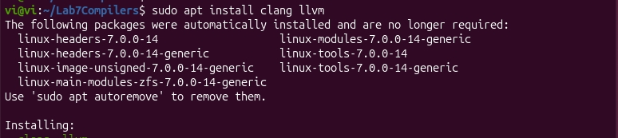
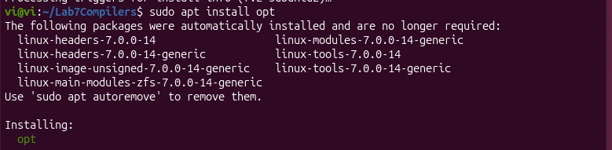
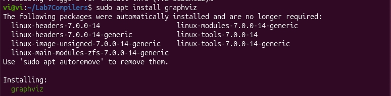

# Работа с AST

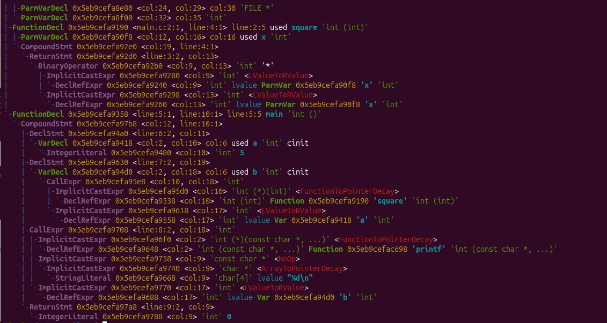

# Генерация LLVM IR
Генерация LLVM IR

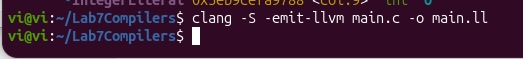
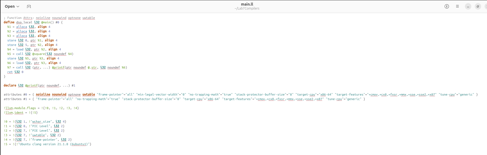


Генерация LLVM IR -O0

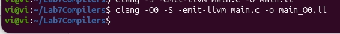
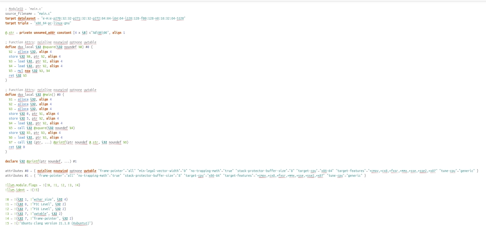


Генерация LLVM IR -O2

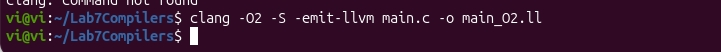
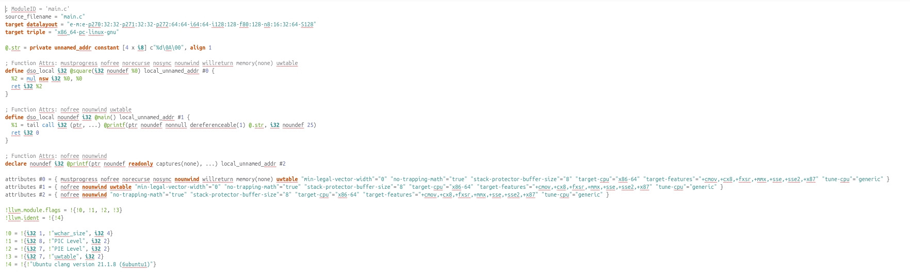


Сравнениие разных генераций LLVM IR

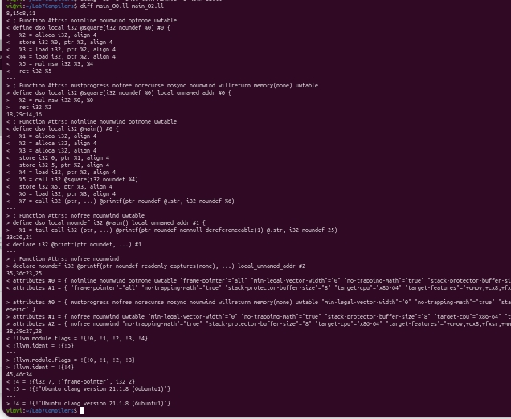

# Оптимизация IR

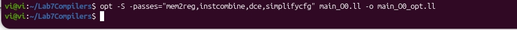
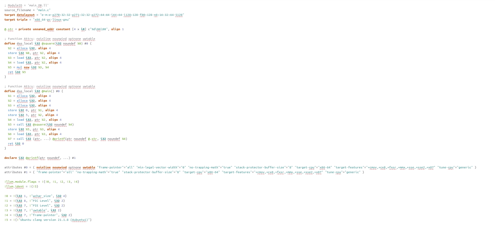


Сравнение с оптимизацией и нет

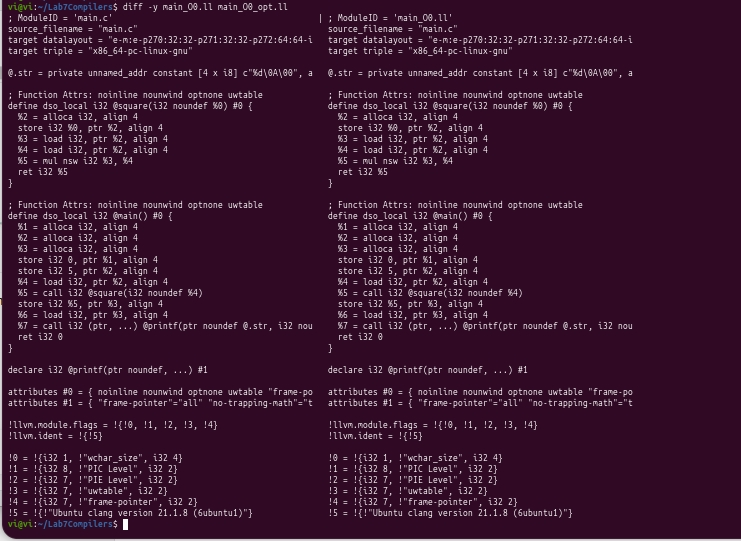


Список оптимизаций: 


# Построение CFG

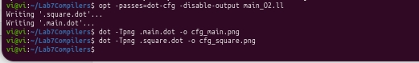
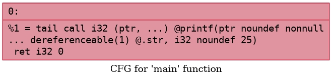
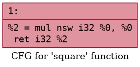

## Индивидуальное задание 
# IR для -O0.


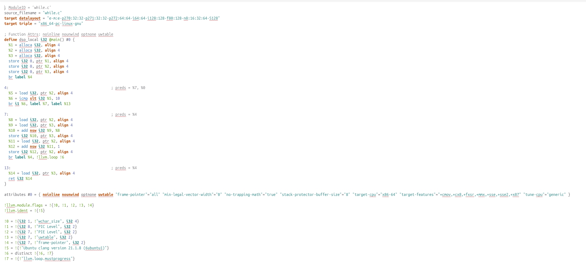


# Применение -indvars, -licm, -loop-unroll

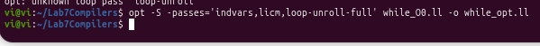
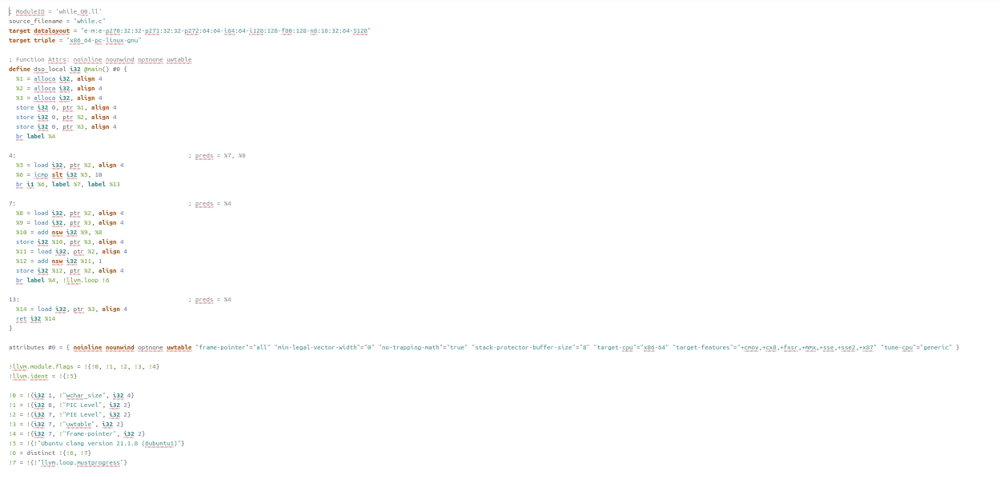

# Построение CFG

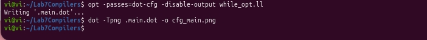
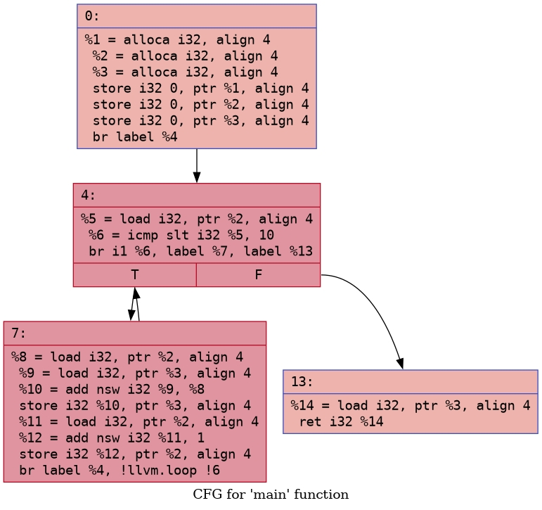

# Отличие while от do-while в IR 
Цикл while выполняет проверку условия перед входом в тело цикла и тело может не выполниться ни разу, тогда как do-while выполняет проверку условия после тела цикла, используя безусловный переход в конец блока и условный переход на выход, что гарантирует хотя бы одну итерацию.

## Выводы
1. Что такое Clang, и какова его роль в процессе компиляции программ?
Clang отвечает за перевод исходного кода в промежуточное представление LLVM IR. Его роль заключается в лексическом, синтаксическом и семантическом анализе текста программы.


2. Что представляет собой LLVM и как он используется в современных компиляторах?
LLVM (Low Level Virtual Machine) - модульная система для построения компиляторов.

Она состоит из следующих частей:

Промежуточное представление (LLVM IR) - универсальный язык между исходным кодом и машинным кодом.
Набор оптимизаций (opt).
Генератор кода - преобразование IR в машинный код.
Современные языки допускают перевод своего кода в промежуточное представление LLVM IR, например, C/C++, Swift, Rust, Julia, что позволяет в дальнейшем оптимизировать код.


3. Чем отличается абстрактное синтаксическое дерево (AST) от промежуточного представления LLVM IR?
Абстрактное синтаксическое дерево (AST) сохраняет высокоуровневую структуру исходного кода, включая синтаксические конструкции (циклы, условные операторы, области видимости). Оно тесно привязано к конкретному языку программирования.

В отличие от AST, LLVM IR является низкоуровневым, платформонезависимым представлением, построенным в SSA-форме. Оно приближено к машинному коду (использует трёхадресные инструкции) и не содержит синтаксической части, что делает его удобным для выполнения анализа потоков данных, оптимизаций и последующей генерации объектного кода.


4. Для чего необходимо промежуточное представление (IR) в процессе компиляции?
Без промежуточного представления для каждой отдельной платформы (x86, RISC) понадобилось бы писать свой компилятор, то есть, 2 языка и 2 платформы означает уже 4 компилятора, что не является эффективным. Промежуточное представление структурирует код на языке высокого уровня, и выполняет его уже в зависимости от целевой платформы, что позволяет разделить ответственность между разработчиками языков и создателями платформ. Оптимизации являются одинаковыми для всех промежуточных представлений, не нужно писать под каждый отдельный язык уже готовые оптимизации, предоставляемые LLVM IR.

5. Что делает инструкция alloc в LLVM IR, и зачем она используется в функциях?
Инструкция alloca в LLVM IR выделяет память на стеке текущей функции во время её выполнения. Она возвращает указатель на выделенную область. alloca используется в функциях для создания локальных переменных, которые могут быть изменяемыми и адрес которых можно брать.

6. Зачем нужна оптимизация кода в компиляторе, и какие основные цели она преследует?
* Уменьшить время выполнения программы.
* Уменьшить размер кода.
* Уменьшить использование памяти.

7. Что такое SSA-форма и почему она важна при оптимизации программ?
SSA (Static Single Assignment) - форма промежуточного представления, где каждая переменная записывается только один раз. Если переменная меняет значение, то создается новая, а не перезаписывается старая.

SSA важна в оптимизации по этим причинам:

Так как каждая переменная неизменна, это позволяет провести свертку констант.
Обнаружение неиспользуемого кода. Если указатель на какое-то значение нигде больше не используется, его можно удалить.
Удаление общих подвыражений. Например, если двум переменным присваивается значение a+b, то можно его один раз посчитать и присвоить обеим переменным, а не считать одно и то же несколько раз.


8. Что такое граф потока управления (CFG) и как он помогает анализировать поведение программы?
Граф потока управления (CFG) — это ориентированный граф, где вершины — базовые блоки (линейные участки кода без переходов), а рёбра — возможные переходы между ними. Он помогает анализировать порядок выполнения программы: находить недостижимый код, выявлять циклы, оптимизировать развёртку циклов и упрощать анализ путей выполнения без низкоуровневых деталей машинного кода.

9. Как устроено представление арифметических операций в LLVM IR (например, умножение, сложение)?
<результат> = <операция> <тип> <операнд1>, <операнд2>

10. Почему функции в LLVM IR обычно представляют собой отдельные единицы анализа и оптимизации?
* Оптимальнее разбить код на много функций, и анализировать каждую в ограниченном контексте.
* В ограниченном контексте функции не нужно учитывать влияние извне (кроме глобальных переменных).
* Возможность оптимизировать каждую функцию в отдельном потоке для повышения производительности.

11. Что происходит с функцией в LLVM IR, если она вызывается один раз и очень короткая?
Ее можно встроить в место вызова.

12. Какие преимущества даёт использование IR и CFG для автоматических оптимизаций по сравнению с анализом исходного текста на C?
* Убирает синтаксический сахар. Например, x++ и ++x и x+1 - одно и то же, поэтому заменится на универсальный %x_new = add i32 %x_old, 1
* CFG показывает пути выполнения наглядно.
* Неизменность переменных (SSA).

## Дополнительное задание
# AST цикла while на языке PHP
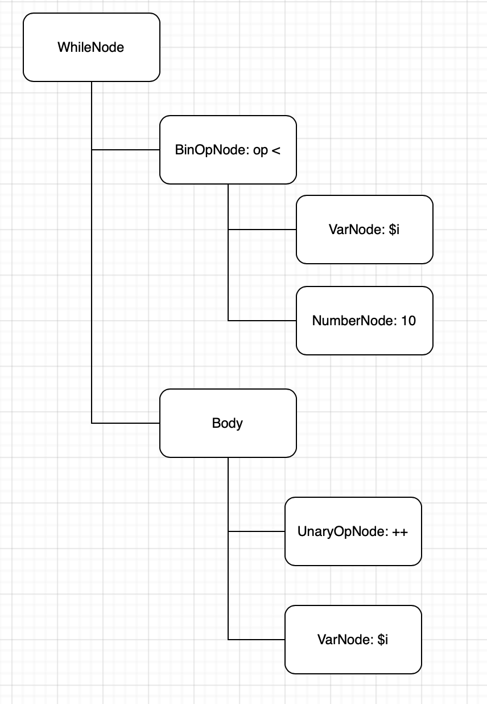
